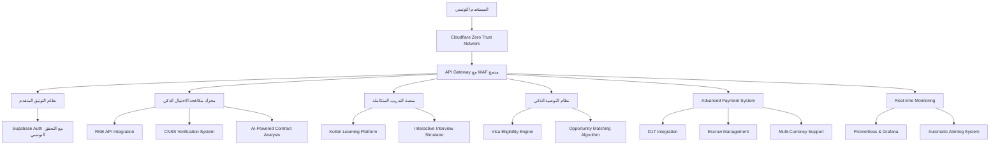

# مشروع "الحارس الذكي" - The Smart Guard Project

## 🏗️ الهندسة المعمارية المتطورة (Advanced Architecture)

البنية التحتية الذكية المتكاملة

```mermaid
graph TB
    A[المستخدم التونسي] --> B[Cloudflare Zero Trust Network]
    B --> C[API Gateway مع WAF مدمج]
    C --> D[نظام التوثيق المتقدم]
    C --> E[محرك مكافحة الاحتيال الذكي]
    C --> F[منصة التدريب المتكاملة]
    C --> G[نظام التوصية الذكي]

    D --> H[Supabase Auth مع التحقق التونسي]
    E --> I[RNE API Integration]
    E --> J[CNSS Verification System]
    E --> K[AI-Powered Contract Analysis]

    F --> L[Kolibri Learning Platform]
    F --> M[Interactive Interview Simulator]

    G --> N[Visa Eligibility Engine]
    G --> O[Opportunity Matching Algorithm]

    C --> P[Advanced Payment System]
    P --> Q[D17 Integration]
    P --> R[Escrow Management]
    P --> S[Multi-Currency Support]

    C --> T[Real-time Monitoring]
    T --> U[Prometheus & Grafana]
    T --> V[Automatic Alerting System]
```